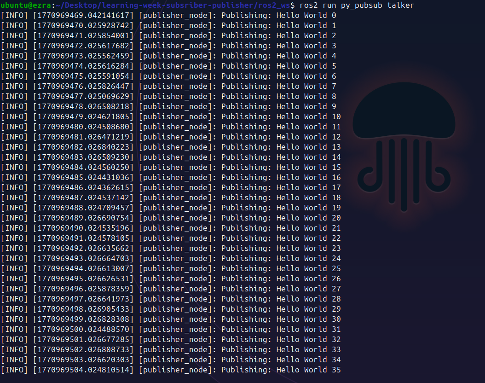
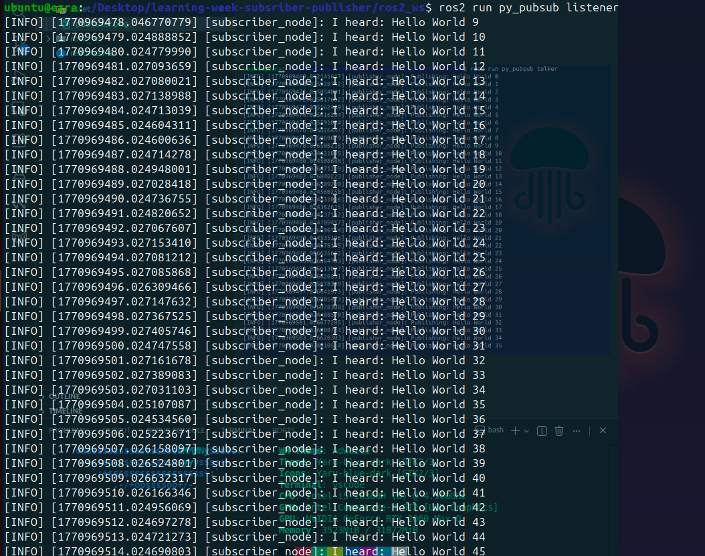

# Learning Week ROS 2 Publisher & Subscriber

Membuat sistem komunikasi sederhana di ROS 2 menggunakan:

* Publisher (Talker)
* Subscriber (Listener)
* Publisher akan mengirim pesan setiap 1 detik, dan Subscriber akan menerima serta menampilkannya.

---

# STEP 1 — Buat Workspace

Buat folder projek :

```bash
mkdir -p ros2_ws/src
cd ros2_ws
```

---

# STEP 2 — Source ROS 2

Pastikan ROS 2 sudah terinstall :

```bash
source /opt/ros/jazzy/setup.bash
```

Cek:

```bash
which ros2
```

---

# STEP 3 — Buat Package Python

Masuk ke folder src:

```bash
cd src
```

Buat package:

```bash
ros2 pkg create --build-type ament_python py_pubsub
```

---

# STEP 4 — Buat Publisher

Masuk ke folder python:

```bash
cd py_pubsub/py_pubsub
```

Buat file:

```bash
nano publisher.py
```

Isi dengan:

```python
import rclpy
from rclpy.node import Node
from std_msgs.msg import String


class Publisher(Node):

    def __init__(self):
        super().__init__('publisher_node')
        self.publisher_ = self.create_publisher(String, 'topic', 10)
        self.timer = self.create_timer(1.0, self.timer_callback)
        self.count = 0

    def timer_callback(self):
        msg = String()
        msg.data = f'Hello World {self.count}'
        self.publisher_.publish(msg)
        self.get_logger().info(f'Publishing: {msg.data}')
        self.count += 1


def main(args=None):
    rclpy.init(args=args)
    node = Publisher()
    rclpy.spin(node)
    node.destroy_node()
    rclpy.shutdown()


if __name__ == '__main__':
    main()
```

---

# STEP 5 — Buat Subscriber

```bash
nano subscriber.py
```

Isi dengan:

```python
import rclpy
from rclpy.node import Node
from std_msgs.msg import String


class Subscriber(Node):

    def __init__(self):
        super().__init__('subscriber_node')
        self.subscription = self.create_subscription(
            String,
            'topic',
            self.listener_callback,
            10
        )

    def listener_callback(self, msg):
        self.get_logger().info(f'I heard: {msg.data}')


def main(args=None):
    rclpy.init(args=args)
    node = Subscriber()
    rclpy.spin(node)
    node.destroy_node()
    rclpy.shutdown()


if __name__ == '__main__':
    main()
```

---

# STEP 6 — Edit package.xml

Tambahkan:

```xml
<exec_depend>rclpy</exec_depend>
<exec_depend>std_msgs</exec_depend>
```

---

# STEP 7 — Edit setup.py

```python
entry_points={
    'console_scripts': [
        'talker = py_pubsub.publisher:main',
        'listener = py_pubsub.subscriber:main',
    ],
},
```

---

# STEP 8 — Build

```bash
cd ../../
colcon build
```

---

# STEP 9 — Jalankan Publisher

```bash
source install/setup.bash
ros2 run py_pubsub talker
```

Output:



---

# STEP 10 — Jalankan Subscriber

Terminal 2:

```bash
cd ros2_ws
source install/setup.bash
ros2 run py_pubsub listener
```

Output:



---

# 🚀 LEARNING WEEK ASSIGNMENT


Berdasarkan project yang telah dibuat, lakukan pengembangan sistem menjadi:

###  2 Publisher dan 1 Subscriber

---

## Ketentuan

### 1️⃣ Publisher 1

* Topic: `/topic1`
* Publish setiap 1 detik
* Format pesan:

  ```
  From Publisher 1: <counter>
  ```

### Publisher 2

* Topic: `/topic2`
* Publish setiap 2 detik
* Format pesan:

  ```
  From Publisher 2: <counter>
  ```

###  Subscriber

* Harus subscribe ke:

  * `/topic1`
  * `/topic2`
* Gunakan 2 callback berbeda
* Output harus dibedakan:

Contoh:

```
[TOPIC1] From Publisher 1: 0
[TOPIC2] From Publisher 2: 0
[TOPIC1] From Publisher 1: 1
```

---
